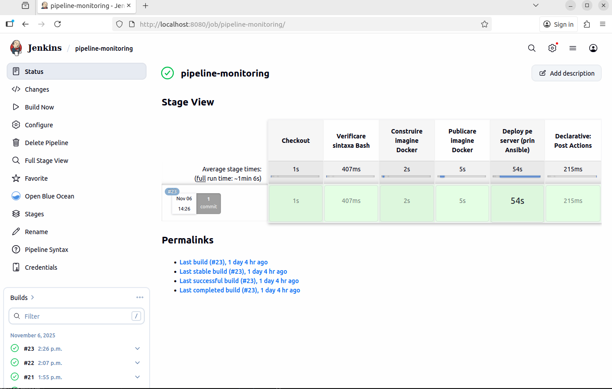
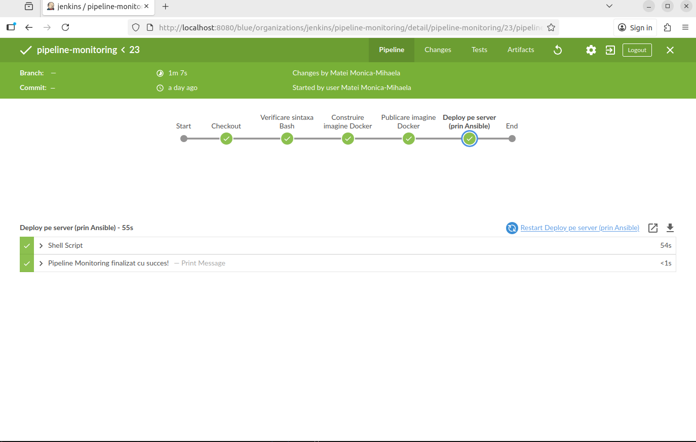
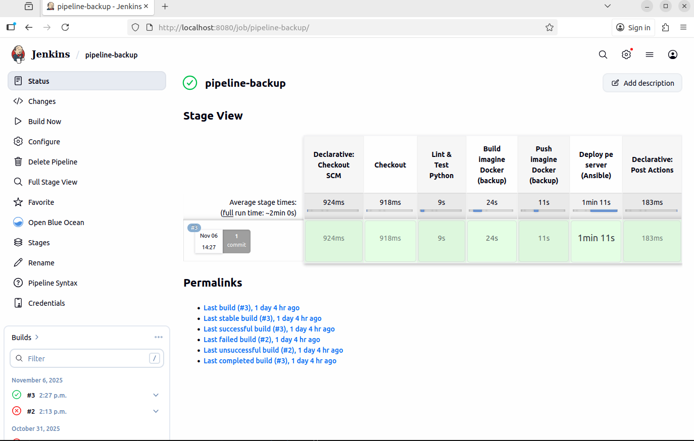
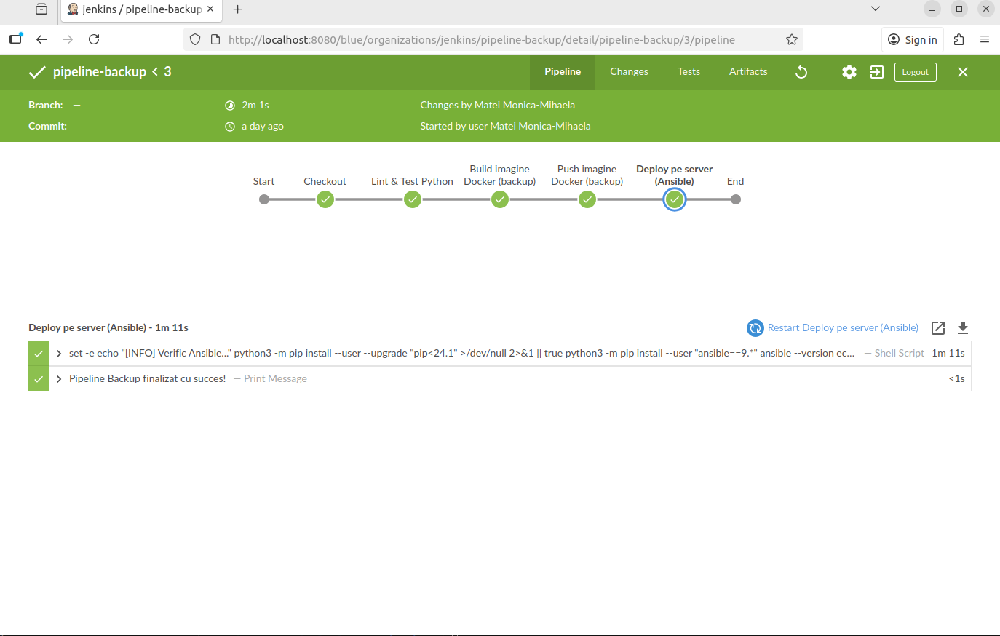

# 🛠️ Platforma de Monitorizare a Starii unui Sistem 🛠️

## Clonare proiect

Pentru a clona acest proiect creați propriul vostru repository EMPTY în GitHub și rulați pas cu pas comenzile de mai jos:

```bash
git clone git@github.com:mateimonicamihaela/platforma-monitorizare.git
cd platforma-monitorizare
git remote -v
git remote remove origin
git remote add origin git@github.com:<USERUL_VOSTRU>/platforma-monitorizare.git
git branch -M main
git push -u origin main
```

## Scopul Proiectului

Acest proiect reprezintă o platformă completă de monitorizare și automatizare DevOps, dezvoltată pentru a demonstra un flux de integrare continuă (CI/CD) și administrare a infrastructurii containerizate. Aplicația urmărește starea sistemului (sau a unui container), colectând periodic informații despre:
- utilizarea procesorului (CPU),
- memoria disponibilă,
- numărul de procese active,
- spațiul de stocare (disk usage),
- uptime, hostname, și alți parametri relevanți.

Datele sunt salvate într-un fișier jurnal (system-state.log), care este actualizat la fiecare interval configurabil de timp.
Un al doilea serviciu, de backup automat, monitorizează modificările fișierului de log și creează copii de siguranță etichetate temporal, asigurând persistența și trasabilitatea datelor în timp.

### Arhitectura proiectului

⚙️ Arhitectura și componentele principale

1. Cele 2 scripturi:

💾 Scriptul de monitorizare (monitoring.sh)
- Rulează periodic și scrie în fișierul system-state.log informații despre starea sistemului.
- Intervalul este configurabil prin variabila de mediu INTERVAL (implicit 5 secunde).
- Poate fi executat atât local, cât și în container Docker.

💾 Scriptul de backup (backup.py)
- Monitorizează fișierul system-state.log și efectuează backup automat dacă detectează modificări.
- Copiile sunt salvate în directorul /data/backup/ și denumite după data și ora curentă.
- Include un mecanism de rotație automată (șterge backup-urile vechi, păstrând ultimele N fișiere).

2. 🐳 Docker
- Fiecare serviciu rulează în propriul container (monitorizare și backup).
- Volumele partajate (/data) permit comunicarea și partajarea logurilor între containere.
- Configurația este gestionată central prin fișierul docker-compose.yml.

3. ☸️ Kubernetes
- Aplicația este orchestrată într-un cluster Kubernetes.
- Un deployment rulează ambele containere în același pod, alături de un container NGINX care expune fișierele de loguri.
- Include un HPA (Horizontal Pod Autoscaler) care scalează automat aplicația între 2 și 10 replici pe baza utilizării CPU și memoriei.
- Rulează într-un namespace dedicat: monitoring.

4. 🧩 Ansible
- Automatizează instalarea și configurarea mediului de rulare (inclusiv Docker și Docker Compose).
- Gestionează deploy-ul aplicației pe mașini remote (VM-uri dedicate).
- Include playbook-uri distincte pentru:
  - instalarea Docker (install_docker.yml),
  - rularea aplicației (deploy_platform.yml).

5. 🏗️ Jenkins (CI/CD)
- Integrează pipeline-uri pentru:
  - build-ul imaginilor Docker;
  - push-ul către Docker Hub;
  - deploy automat în Kubernetes;
  - testarea aplicației și verificarea backup-urilor.

- Fiecare serviciu (monitoring și backup) are propriul pipeline în jenkins/pipelines/.

6. 🌍 Terraform
- Definește infrastructura de bază pentru rularea aplicației:
  - crearea VM-urilor,
  - configurarea rețelei și volumelor persistente,
  - setarea backend-ului de stocare pentru starea Terraform.

- Permite aprovizionarea rapidă a mediilor de test, staging și producție.


📊 Beneficii și rezultate
- 🔁 Monitorizare continuă și centralizată a resurselor.
- 💾 Backup automat, sigur și trasabil al datelor.
- 🧱 Containere ușor portabile, integrate în pipeline-uri DevOps.
- ☸️ Scalabilitate automată prin Kubernetes HPA.
- ⚙️ Automatizare completă a instalării și deploy-ului prin Ansible.
- 🚀 CI/CD configurat end-to-end cu Jenkins.
- ☁️ Infrastructură definită ca cod (IaC) prin Terraform.

```bash
.
├── ansible
│   ├── ansible.cfg
│   ├── inventory.ini
│   ├── playbooks
│   │   ├── deploy_platform.yml
│   │   └── install_docker.yml
│   └── requirements.yml
├── data
│   ├── backup
│   │   ├── system-state-20251107-161149.log
│   │   ├── system-state-20251107-161154.log
│   │   ├── system-state-20251107-161159.log
│   │   ├── system-state-20251107-161204.log
│   │   ├── system-state-20251107-161209.log
│   │   ├── system-state-20251107-161215.log
│   │   ├── system-state-20251107-161221.log
│   │   ├── system-state-20251107-161227.log
│   │   ├── system-state-20251107-161232.log
│   │   └── system-state-20251107-161237.log
│   └── system-state.log
├── docker
│   ├── backup
│   │   └── Dockerfile
│   ├── docker-compose.yml
│   └── monitoring
│       └── Dockerfile
├── imagini
│   └── jenkins-logo.png
├── jenkins
│   └── pipelines
│       ├── backup
│       │   └── Jenkinsfile
│       └── monitoring
│           └── Jenkinsfile
├── k8s
│   ├── deployment.yaml
│   ├── hpa.yaml
│   ├── namespace.yaml
│   └── nginx-config.yaml
├── README.md
├── scripts
│   ├── backup.py
│   └── monitoring.sh
└── terraform
    ├── backend.tf
    ├── locals.tf
    ├── main.tf
    ├── outputs.tf
    ├── providers.tf
    ├── variables.tf
    └── versions.tf
```

## Structura Proiectului

- `/scripts`: 
    - `monitoring.sh`: script Bash care monitorizează resursele sistemului (CPU, RAM, spațiu pe disc, procese active, uptime). Scrie periodic informațiile în fișierul data/system-state.log.
    - `backup.py`: script Python care verifică dacă fișierul de log al sistemului (system-state.log) s-a modificat și, dacă da, face un backup în data/backup/ cu timestamp unic.

- `/docker`: 
    - `monitoring/Dockerfile`: definește imaginea Docker pentru containerul de monitorizare; copiază scriptul monitoring.sh și îl rulează periodic.
    - `backup/Dockerfile`: definește imaginea Docker pentru containerul de backup; copiază scriptul backup.py și îl rulează automat pentru a salva copii ale logului.
    - `docker-compose.yaml`: lansează ambele servicii (monitoring și backup) în containere separate, conectate printr-un volum partajat pentru fișierele de log și backup.

- `/k8s`:
    - `deployment.yaml`: definește un Deployment Kubernetes care rulează cele 3 containere (monitoring, backup și nginx) într-un singur Pod.
    - `hpa.yaml`: configurare de Horizontal Pod Autoscaler bazat pe consumul de CPU și memorie, pentru scalarea automată a aplicației.
    - `namespace.yaml`: definește un namespace Kubernetes numit monitoring, în care vor fi create toate resursele aplicației.
    - `nginx-config.yaml`: conține configurarea Nginx (reverse proxy / server web) pentru a expune datele de monitorizare către exterior, cu eventuale rute sau cache-uri specifice aplicației.

- `/ansible`:
    - `install_docker.yml`: configurarea principală a Ansible (căi, timeout, inventory implicit).
    - `deploy_platform.yml`: definește mașinile-țintă (de exemplu VM-ul vm1 de pe IP 192.168.100.240) și utilizatorii (monitor, jenkins).
    - `inventory.ini`: definește VM-urile țintă
    - `requirements.yml`: listează colecțiile Ansible necesare (ex: community.docker pentru gestiunea containerelor).
    - `playbooks/install_docker.yml`: playbook care instalează Docker Engine și dependințele pe mașina remote, pregătind mediul de execuție.
    - `playbooks/deploy_platform.yml`: playbook care clonează repository-ul, copiază fișierele docker-compose.yml și rulează containerele aplicației folosind docker compose up -d.

- `/jenkins/pipelines`:
    - `monitoring/Jenkinsfile`: definește pipeline-ul CI/CD pentru containerul de monitorizare:
        - verifică sintaxa Bash (bash -n)
        - construiește imaginea Docker
        - o publică în Docker Hub
        - rulează deploy automat pe VM prin Ansible.
    - `backup/Jenkinsfile`: definește pipeline-ul CI/CD pentru containerul de backup (scriptul Python): build → push → deploy.

- `/terraform`:
    - `main.tf`: creează infrastructura simulată AWS (prin LocalStack):
        - instanță EC2 (mașina vm-monitoring),
        - bucket S3 pentru artefacte,
        - key pair SSH (monitor-key)
        - security group cu acces SSH (22) și HTTP (80).
    - `backend.tf`: configurează stocarea remote a state-ului Terraform în bucketul S3 (tf-state-platforma-monitorizare).
    - `variables.tf`: definește variabilele reutilizabile (nume instanță, regiune, tag-uri).
    - `outputs.tf`: afișează valorile utile după creare (de ex. instance_id, bucket_name, ip).
    - `providers.tf`: definește provider-ul AWS, conectat la LocalStack prin endpoint-uri locale.
    - `locals.tf`: conține tag-uri și variabile locale comune tuturor resurselor.
    - `versions.tf`: stabilește versiunile minime compatibile de Terraform și de provider AWS.

## Setup și Rulare pentru cele 2 scripturi

🖥️ scripts/monitoring.sh

- Suprascrie fișierul `system-state.log` 
- Perioada la care se printeaza in fisierul `system-state.log` este prin `export INTERVAL=5`

💾 scripts/backup.py

- Creează backup doar dacă fișierul s-a modificat
- Numele backup-ului include data și ora
- Directorul de backup este configurabil cu `export BACKUP_DIR=backup`
- Logurile sunt clare și informative
- Tratează toate excepțiile fără a se opri

⚙️ Variabile de mediu utilizate în proiect

| Variabilă           | Utilizată de  | Descriere                                                              | Valoare implicită                                                         | Exemplu suprascriere                                         |
| ------------------- | ------------- | ---------------------------------------------------------------------- | ------------------------------------------------------------------------- | ------------------------------------------------------------ |
| **INTERVAL**        | monitoring.sh | Intervalul în secunde la care se colectează informațiile despre sistem | `5`                                                                       | `INTERVAL=2 ./scripts/monitoring.sh`                         |
| **OUT_FILE**        | monitoring.sh | Calea către fișierul în care se scrie starea sistemului                | `./system-state.log` *(local)*<br>`/data/system-state.log` *(Docker/K8s)* | `OUT_FILE=./data/system-state.log ./scripts/monitoring.sh`   |
| **BACKUP_INTERVAL** | backup.py     | Intervalul în secunde la care se verifică modificarea logului          | `5`                                                                       | `BACKUP_INTERVAL=5 python3 scripts/backup.py`                |
| **SRC_FILE**        | backup.py     | Calea fișierului `system-state.log` monitorizat pentru schimbări       | `./system-state.log` *(local)*<br>`/data/system-state.log` *(Docker/K8s)* | `SRC_FILE=./data/system-state.log python3 scripts/backup.py` |
| **BACKUP_DIR**      | backup.py     | Directorul în care sunt salvate copiile logului                        | `./backup` *(local)*<br>`/data/backup` *(Docker/K8s)*                     | `BACKUP_DIR=./data/backup python3 scripts/backup.py`         |
| **MAX_BACKUPS**     | backup.py     | Numărul maxim de backup-uri păstrate                                   | `10`                                                                      | `MAX_BACKUPS=5 python3 scripts/backup.py`                    |


Recomandare de rulare:

```bash
# Rulare monitorizare
cd ~/work/platforma-monitorizare/scripts/
chmod +x monitoring.sh
cd ~/work/platforma-monitorizare
export INTERVAL=5
export OUT_FILE=./data/system-state.log 
./scripts/monitoring.sh

# Rulare backup
cd ~/work/platforma-monitorizare
export BACKUP_INTERVAL=5
export SRC_FILE=./data/system-state.log 
export BACKUP_DIR=./data/backup
python3 scripts/backup.py
```


## Setup și Rulare Docker
In această secțiune este documentat modul de împachetare și rulare a celor două scripturi (monitorizare și backup) în imagini Docker separate.
Aplicația poate rula atât individual, cât și împreună, folosind servicii Docker conectate printr-un volum comun.

3 secțiuni pentru Docker:

  - 1️⃣ Build manual al imaginilor Docker

  - 2️⃣ Rulare individuală cu docker run

  - 3️⃣ Rulare orchestrată cu docker compose


🐳 Rulare cu Docker (fără Docker Compose)

✅ 1) Construirea imaginilor Docker

```bash
cd ~/work/platforma-monitorizare/docker

docker build -t mateimonicamihaela/monitoring:latest \
  --file monitoring/Dockerfile ../

docker build -t mateimonicamihaela/backup:latest \
  --file backup/Dockerfile ../
```

✅ 2) Rularea containerelor individual

▶️ Container monitoring

Scrie system-state.log în volumul mapat local:

```bash
docker run -d \
  --name monitoring-container \
  -e INTERVAL=5 \
  -e OUT_FILE=/data/system-state.log \
  -v "$(pwd)"/../data:/data \
  mateimonicamihaela/monitoring:latest
```
▶️ Containerul de backup

Face backup periodic doar dacă logul s-a modificat:

```bash
docker run -d \
  --name backup-container \
  -e BACKUP_INTERVAL=5 \
  -e SRC_FILE=/data/system-state.log \
  -e BACKUP_DIR=/data/backup \
  -v "$(pwd)"/../data:/data \
  mateimonicamihaela/backup:latest
```

🔍 Cum afli numele containerului exact

Ruleaza:
```bash
docker ps
```

🧰 Testare manuală

Putem verifica direct continutul din containere:

```bash
docker exec -it monitoring-container cat /data/system-state.log
docker exec -it backup-container ls /data/backup
```

🔧 Acces interactiv în containere
```bash
docker exec -it monitoring-container bash     # Containerul de monitorizare (Bash script)
docker exec -it backup-container bash         # Containerul de backup (Python script)
```

🔍 Vizualizare loguri
```bash
docker logs monitoring-container    # Logurile din containerul de monitorizare
docker logs backup-container        # Logurile din containerul de backup
```

Afișare log execuție live (actualizare in timp real):
```bash
docker logs -f monitoring-container
docker logs -f backup-container
```

După câteva secunde de rulare, verificăm fisierele locale:
```bash
ls -lh ../data/
ls -lh ../data/backup/
```
🛑 Oprire și ștergere containere

```bash
docker stop monitoring-container backup-container
docker rm monitoring-container backup-container
```

✅ 3) Rulare orchestrată cu Docker Compose

Pentru rularea completă a aplicației se folosește un volum partajat și setări de rețea automate via Docker Compose.

Intram in folderul Docker:
```bash
cd ~/work/platforma-monitorizare/docker
```

Construim imaginile Docker:
```bash
docker compose build
```

Pornim serviciile in fundal:
```bash
docker compose up -d  
```

Verificam daca ambele containere ruleaza:
```bash
docker ps      
```

Vizualizam logurile aplicatiei:
```bash
docker compose logs -f       
```

Oprim containerele:
```bash
docker compose down                              
```

🔗 Cum comunică între ele containerele

Containerele nu comunică prin rețea, ci prin volumul local montat:

| Container            | Scrie în                 | Citește din              | Director local            |
| -------------------- | ------------------------ | ------------------------ | ------------------------- |
| `monitoring-service` | `/data/system-state.log` | —                        | `./data/system-state.log` |
| `backup-service`     | `/data/backup/`          | `/data/system-state.log` | `./data/backup/`          |

Astfel, backup-service vede fișierul actualizat de monitoring-service și creează copii noi doar dacă fișierul s-a modificat.

☁️ (Opțional) Publicarea imaginilor în Docker Hub

După ce verificam că totul funcționează, rulam:
```bash
docker images
```

Avem doua imagini locale:
- docker-monitoring:latest → monitoring
- docker-backup:latest → backup

Le etichetam corect pentru Docker Hub și le dam push cu comenzile de mai jos:

(1) Autentificare o singură dată (dacă nu ești logat)
```bash
docker login
```

(2) Monitoring → tag + push
```bash
docker tag docker-monitoring:latest mateimonicamihaela/monitoring:latest
docker push mateimonicamihaela/monitoring:latest
```

(3) Backup → tag + push
```bash
docker tag docker-backup:latest mateimonicamihaela/backup:latest
docker push mateimonicamihaela/backup:latest
```


## Setup și Rulare in Kubernetes

1. Precondiții (Porneste Minikube + Activează metrics-server (pentru HPA))
```bash
cd ~/work/platforma-monitorizare
minikube start
minikube addons enable metrics-server
kubectl get pods -A | grep metrics
```

Dacă NU ai imaginile în Docker Hub:
```bash
# după ce ai făcut build local
minikube image load mateimonicamihaela/monitoring:latest
minikube image load mateimonicamihaela/backup:latest
```

2.  Namespace: aplicatia trebuie sa ruleze intr-un namespace cu numele monitoring

k8s/namespace.yaml
```bash
kubectl apply -f k8s/namespace.yaml
```

3. ConfigMap Nginx (pentru listare /logs și redirect)
```bash
kubectl -n monitoring apply -f k8s/nginx-config.yaml
```

4. Creati un deployment cu 2 replici ce ruleaza in acelasi pod ambele containere,plus un container nginx ce expunee fisierul de loguri de sistem --> 3 containere/pod + Service

```bash
kubectl -n monitoring apply -f k8s/deployment.yaml
```
5. Adaugati un HPA pe baza de CPU și memorie configurat cu min replicas 2 si max replicas 10)
```bash
kubectl -n monitoring apply -f k8s/hpa.yaml
```

6. Verificare rapidă & acces

```bash
kubectl -n monitoring get pods
kubectl -n monitoring get deploy,svc,hpa
kubectl -n monitoring describe hpa platforma-monitorizare-hpa
kubectl top pods -n monitoring   # necesită metrics-server
```
HPA-ul platforma-monitorizare-hpa scalează deployment-ul platforma-monitorizare între 2 și 10 replici, în funcție de utilizarea de CPU și memorie. Metricele sunt colectate prin metrics-server. La pornire, HPA poate raporta erori temporare de tipul „unable to get metrics for resource cpu/memory” până când metrics-server devine complet operațional. După stabilizare, condițiile HPA (AbleToScale=True, ScalingActive=True, ScalingLimited=False) confirmă că autoscalarea funcționează corect.

7. Acces la aplicație (Nginx care servește logurile)

Varianta 1 - Deschide în browser (URL generat de Minikube):
```bash
minikube service -n monitoring platforma-monitorizare --url

# Accesează:
#   <URL>/logs/system-state.log 
#   <URL>/logs/backup/   (listă de fișiere; autoindex activ din ConfigMap) 
```

Varianta 2 - Port-forward (convenabil pentru demo)
```bash
kubectl -n monitoring port-forward svc/platforma-monitorizare 8080:80

# apoi în alt terminal:
curl http://localhost:8080/logs/system-state.log

# sau in browser:
http://localhost:8080/logs/system-state.log
```

Verificam ce proces folosește portul 8080:
```bash
sudo lsof -i:8080      # Vezi ce proces folosește portul 8080:
sudo kill 1234         # Oprește procesul (în exemplu, PID = 1234):
sudo kill -9 1234      # Dacă nu moare, dam comanda asta si pe urma reia port-forward-ul
```


8. Vezi logurile din containere

Monitorizare:
```bash
kubectl -n monitoring logs deploy/platforma-monitorizare -c monitoring --tail=30 -f
```

Backup:
```bash
kubectl -n monitoring logs deploy/platforma-monitorizare -c backup --tail=30 -f
```

🔗 Exemple de URL complet pentru accesarea aplicației:

Logul curent al sistemului:

http://192.168.49.2:32055/logs/system-state.log

Backup-urile efectuate

http://192.168.49.2:32055/logs/backup/


🧠 Cum se verifică in terminal:

curl http://192.168.49.2:32055/logs/system-state.log

curl http://192.168.49.2:32055/logs/backup/


🧩 Structura actuală a Pod-ului (din k8s/deployment.yaml)

În Pod avem 3 containere care rulează împreună și partajează un volum /data comun:

| Container        | Rol                                                                                         | Porturi expuse         | Persistență                         |
| ---------------- | ------------------------------------------------------------------------------------------- | ---------------------- | ----------------------------------- |
| 🖥️  `monitoring` | rulează `monitoring.sh` – colectează starea sistemului și scrie în `/data/system-state.log` | ❌ nu expune porturi    | ✅ scrie în `/data/system-state.log` |
| 🧱 `backup`      | rulează `backup.py` – monitorizează fișierul de log și face copii în `/data/backup/`        | ❌ nu expune porturi    | ✅ salvează în `/data/backup/`       |
| 🌐 `nginx`       | servește prin HTTP conținutul din `/data/` (loguri + backup-uri)                            | ✅ expune portul **80** | ✅ montează `/data` read-only        |


Alternativă completă — „hard reset” (dacă vrem să curețam tot )
```bash
docker compose down --remove-orphans
docker container prune -f
docker image prune -f
docker volume prune -f
docker network prune -f
docker compose up -d
```


## Setup și Rulare in Ansible

1. Bootstrap VM nou + user nou (o singură dată)

 Pe masina remote (masina noua) adaugam un user nou si ii setam cheia de ssh 

Creează userul nou (ex: monitor) 
```bash
sudo adduser monitor
```

Adaugam userul monitor in userii cu drept de sudo
```bash
sudo usermod -aG sudo monitor
groups monitor
```

Adaugam userul monitor in lista de useri ce nu au nevoie de parola la sudo
```bash
cd /etc/sudoers.d/
echo "monitor ALL=(ALL) NOPASSWD:ALL" | sudo tee monitor-nopasswd
```

(monitor este userul pe care il foloseste Ansible sa faca ssh pe masina server)
```bash
su - monitor
```

Verificam ca putem face sudo fara parola
```bash
sudo ls
```

Adaugam cheia de ssh a userului monitor in masina remote. Atentie: trebuie sa fiti logati cu userul monitor cand rulati aceste comenzi
```bash
mkdir .ssh
touch ~/.ssh/authorized_keys
echo “cheie ssh publica de pe masina client” >> ~/.ssh/authorized_keys
cat ~/.ssh/authorized_keys
```

Instalam ssh server pe masina remote
```bash
sudo apt update
sudo apt install -y openssh-server
service ssh status
```

Luam IP-ul masinii remote (IP-ul care nu se termina in .1)
```bash
ip addr | grep 192.168
```

Ne afiseaza: 
```bash
monitor@baseline:~$ ip addr | grep 192.168
    inet 192.168.100.240/24 brd 192.168.100.255 scope global dynamic noprefixroute enp0s8
    inet 192.168.49.1/24 brd 192.168.49.255 scope global br-4ef4fc0cb34f
```

Revenim pe masina client (ubuntu2204) si incercam sa facem ssh cu userul monitor
```bash
ssh monitor@192.168.100.240
```

2. Ansible pe mașina locala + inventory

Instalam pip pentru Python3
```bash
sudo apt update
sudo apt install -y python3-pip
pip3 --version
```

Instalam Ansible pe masina client (ubuntu2204).
```bash
sudo apt update
sudo apt install -y ansible 
ansible --version
```

Pe masina client (ubuntu2204) citim cheia publica a userului curent
```bash
cat ~/.ssh/id_rsa.pub
```

Revenim pe masina client (ubuntu2204) si incercam sa facem ssh cu userul monitor
```bash
ssh monitor@192.168.100.240
```
Asigură-te că există Python 3 pe VM (Ansible are nevoie)
```bash
sudo apt-get update
sudo apt-get install -y python3
```
Intoarce-te la userul eu
```bash
exit
```

ansible/ansible.cfg

ansible/inventory.ini (actualizează IP-ul!)

ansible/requirements.yml

Instalează colecția pe mașina de control:

```bash
cd ansible
ansible-galaxy collection install -r requirements.yml
```

Test ping simplu
```bash
sudo -u jenkins -H bash -lc 'ansible -i inventory.ini monitoring_vm -m ping'
```


3. Playbook 1 — Instalează Docker (Docker CE + compose plugin)

ansible/playbooks/install_docker.yml

Rulează:
```bash
cd ansible
sudo -u jenkins -H bash -lc 'ansible-playbook playbooks/install_docker.yml'
```


4. Playbook 2 — Deploy cu docker compose + verificări log & backup

Acest playbook:

- clonează repo-ul meu pe VM în /opt/platforma-monitorizare

- rulează docker compose up -d din docker/

- așteaptă să apară system-state.log

- verifică faptul că s-a creat cel puțin un fișier în data/backup/


ansible/playbooks/deploy_platform.yml

```bash
sudo -u jenkins -H bash -lc 'ansible-playbook playbooks/deploy_platform.yml'
```

Verificări manuale: 

Pe masina remote cu userul nou

```bash
ssh monitor@192.168.100.240
docker ps --format 'table {{.Names}}\t{{.Image}}\t{{.Status}}'
sudo ls -lh /opt/platforma-monitorizare/data
sudo ls -lh /opt/platforma-monitorizare/data/backup
sudo tail -n 20 /opt/platforma-monitorizare/data/system-state.log
```
Pe masina locala

```bash
sudo -u jenkins -H bash -lc 'ansible monitoring_vm -m command -a "docker ps"'
```


## Jenkins - CI/CD și Automatizari


Instalam Jenkins

```bash
 # Actualizează sistemul
sudo apt update && sudo apt upgrade -y
# Instalează Java (Jenkins are nevoie de Java 17+)
sudo apt install openjdk-17-jdk -y   
# Verificam versiunea sa fie openjdk version "17.0.13" 2025-07-09         
java -version                                 

# Adaugă repository-ul oficial Jenkins

curl -fsSL https://pkg.jenkins.io/debian/jenkins.io-2023.key | sudo tee \
  /usr/share/keyrings/jenkins-keyring.asc > /dev/null

echo deb [signed-by=/usr/share/keyrings/jenkins-keyring.asc] \
  https://pkg.jenkins.io/debian binary/ | sudo tee \
  /etc/apt/sources.list.d/jenkins.list > /dev/null    

# Instalează Jenkins
sudo apt update
sudo apt install jenkins -y

# Pornește și activează serviciul
sudo systemctl enable jenkins
sudo systemctl start jenkins
sudo systemctl status jenkins

# Deschide portul 8080 (dacă e firewall activ)
sudo ufw allow 8080
sudo ufw reload

# Accesează Jenkins în browser
👉 http://localhost:8080

sau, dacă e pe o mașină virtuală:
👉 http://<IP_VM>:8080

# Preia parola inițială
sudo cat /var/lib/jenkins/secrets/initialAdminPassword

# Finalizează configurarea în browser
1. Selectează "Install suggested plugins"

2. Creează utilizatorul: mateimonicamihaela

3. Accesează Dashboard-ul Jenkins 

Pluginuri necesare

În Jenkins → Manage Jenkins → Plugins:
  - Available (căutare și instalare):

    - Git (git, git client)
    - Pipeline (workflow-aggregator)
    - Docker Pipeline și Docker (docker, docker commons)
    - Credentials Binding
    - Blue Ocean
    - Role-based Authorization Strategy
Reboot Jenkins dupa fiecare plugine instalat.
```

### 🧩 Setări Jenkins necesare

Creează următoarele:

🔹 Credentiale Docker Hub

Creează în Jenkins → Manage Jenkins → Credentials, un Secret Text sau Username + Password Credential cu ID:
  - ID: dockerhub-credentials
  - User: mateimonicamihaela (contul tău Docker Hub)
  - Pass / token: parola contului (sau token-ul generat din Docker Hub)

🔹 User dedicat Jenkins

În Jenkins, mergi la Manage Jenkins → Security → Users → Create User
  - Creează utilizatorul:
    - Username: monitoring-ci
    - Role: doar acces la platforma-monitorizare
  - Activează Role-Based Strategy Plugin
  - Configurează acces doar pentru:
    - pipeline-urile backup și monitoring
    - fără drepturi administrative

🔹 SSH către VM pentru deploy (private key)
  - ID: vm_ssh_key
  - Username: monitor
  - Private key: (cheia care are acces la VM-ul tău)
  - Host: VM-ul pe care rulezi (poți specifica în Jenkinsfile ca variabilă)


### 1️⃣ Pipeline-uri Jenkins (detaliat)

Pipeline-uri (joburi) din Jenkinsfile-urile din repo

Vom crea 2 Pipeline jobs (tip Pipeline → “Pipeline script from SCM”).

### A. Monitoring (Bash)

1. New Item → Name: pipeline-monitoring → Pipeline → OK

2. Pipeline → Definition: Pipeline script from SCM

    - SCM: Git

    - Repository URL: https://github.com/mateimonicamihaela/platforma-monitorizare.git

    - Credentials: (idem)

    - Branch: */main

    - Script Path: jenkins/pipelines/monitoring/Jenkinsfile

3. Save → Build Now.


### B. Backup (Python)

1. New Item → Name: pipeline-backup → Pipeline → OK

2. Pipeline → Definition: Pipeline script from SCM

    - SCM: Git

    - Repository URL: https://github.com/mateimonicamihaela/platforma-monitorizare.git

    - Credentials: (nimic sau github-token, dacă e privat)

    - Branch Specifier: */main

    - Script Path: jenkins/pipelines/backup/Jenkinsfile

3. Save → Build Now.


> **Repository:** `platforma-monitorizare`  
> **Pipeline-uri:**
> - `pipeline-monitoring` – CI/CD pentru containerul *monitoring* (script Bash)
> - `pipeline-backup` – CI/CD pentru containerul *backup* (script Python)


### 🚀 1.1 Pipeline: Monitoring

**Scop:**  
Verifică sintaxa scriptului Bash, construiește imaginea Docker, o publică în Docker Hub și face *deploy* pe VM via Ansible.

**Locație Jenkinsfile:**  
`jenkins/pipelines/monitoring/Jenkinsfile`

**Credențiale folosite:**
- `dockerhub-credentials` – pentru autentificare Docker Hub
- `github-ssh` – cheie SSH pentru acces Git (opțional)

**Condiții pe agentul Jenkins:**
- Utilizatorul `jenkins` face parte din grupul `docker`  
- Acces SSH configurat către `monitor@192.168.100.240`
- Cheia privată se află la `/var/lib/jenkins/.ssh/id_rsa`
- `ansible==9.*` și `community.docker==3.10.3` sunt instalate local

**Etapele pipeline-ului:**
1. **Checkout:**  
   Obține codul din GitHub (branch `main`).

2. **Verificare sintaxă Bash:**  
   ```bash
   bash -n scripts/monitoring.sh
  ```

Dacă există erori, buildul se oprește.

3. **Construire imagine Docker:**

  ```bash
   docker build -t mateimonicamihaela/monitoring:latest -f docker/monitoring/Dockerfile .
   ```

4. **Publicare imagine Docker:**
 - Autentificare cu docker login
 - Publicare imagine:
  ```bash
  docker push mateimonicamihaela/monitoring:latest
  ```
 - Logout după încărcare

5. **Deploy pe server (prin Ansible):**
    - Setează locale UTF-8 pentru Ansible
    - Rulează upgrade pip și instalează ansible==9.*
    - Instalează colecțiile din ansible/requirements.yml
    - Rulează playbookul:

  ```bash
  sudo -u jenkins -H bash -lc 'ansible-playbook -i ansible/inventory.ini ansible/playbooks/deploy_platform.yml'
  ```

Exemplu inventar:

```bash
[monitoring_vm]     
vm1 ansible_host=192.168.100.240 ansible_user=monitor ansible_ssh_private_key_file=/var/lib/jenkins/.ssh/id_rsa

[all:vars]
ansible_python_interpreter=/usr/bin/python3
```

Rezultat așteptat:

La finalul rulării:

```bash
docker ps
# backup-service       mateimonicamihaela/backup:latest       Up ...
# monitoring-service   mateimonicamihaela/monitoring:latest   Up ...
```

### Imagine Pipeline Monitoring - Stage 



### Imagine Pipeline Monitoring - Blue Ocean




### 🚀 1.2 Pipeline: Backup

**Scop:**  
Construiește și publică imaginea Docker pentru containerul backup (scriptul Python) și rulează deploy automat.

**Locație Jenkinsfile:**  
`jenkins/pipelines/backup/Jenkinsfile`

**Etapele pipeline-ului:**
1. **Checkout:**  
   Obține codul din GitHub (branch `main`).

2. **Verificare Python (opțional):**
   ```bash
    python3 -m pip install --user ruff pytest
    ~/.local/bin/ruff scripts/backup.py
    pytest
   ```

3. **Construire imagine Docker:**
  ```bash
   docker build -t mateimonicamihaela/backup:latest -f docker/backup/Dockerfile .
   ```
   
4. **Publicare imagine Docker:**

   - Autentificare cu docker login
   - Publicare imagine:

  ```bash
  docker push mateimonicamihaela/backup:latest
  ```
    - Logout după încărcare

5. **Deploy pe server (prin Ansible):**
    - Rulează același playbook Ansible ca și pipeline-ul de monitoring.
  ```bash
  sudo -u jenkins -H bash -lc 'ansible-playbook -i ansible/inventory.ini ansible/playbooks/deploy_platform.yml'
  ```

Rezultat așteptat:

La finalul rulării:

```bash
docker ps
# backup-service       mateimonicamihaela/backup:latest       Up ...
# monitoring-service   mateimonicamihaela/monitoring:latest   Up ...
```

### Imagine Pipeline Backup - Stage



### Imagine Pipeline Backup - Blue Ocean




### 2️⃣ Automatizări și configurări Jenkins

🔐 2.1 Crearea unui utilizator dedicat proiectului

Obiectiv:
Crearea unui user non-admin cu acces doar la joburile proiectului.

Pași:

1. **Instalează pluginul Role-based Authorization Strategy**

Manage Jenkins → Plugins → Available → căutare „Role-based Authorization Strategy” → Install & Restart Jenkins

2. **Activează strategia de autorizare pe baza de roluri:**

Manage Jenkins → Global Security → Authorization → Role-Based Strategy

🔁 Jenkins va reîncărca interfața și acum vei avea un meniu nou:

```bash
Manage Jenkins → Manage and Assign Roles
```

3. **Creează userul:**

Manage Jenkins → Users → Create User → “monitoring-ci"

Completează:

  - Username: monitoring-ci
  - Password: (alege o parolă simplă)
  - Full name: „Monitorizare CI/CD”
  - Email: (opțional)

Apasă Create User

4. **Configurează roluri:**

Manage Jenkins → Manage and Assign Roles → Manage Roles

Acolo ai trei secțiuni:

Global roles, Project roles, și View roles.

➤ În „Global roles”, adaugă:

| Rol              | Drepturi                                                         |
| ---------------- | ---------------------------------------------------------------- |
| `admin`          | bifează tot                                                      |
| `platforma-user` | bifează doar **Overall → Read**, **Job → Read**, **View → Read** |

Creează un rol pentru proiect

Derulează mai jos, la Project roles.

Adaugă un rol nou:

| Rol                 | Regex (pattern) | Drepturi                                 |
| ------------------- | --------------- | ---------------------------------------- |
| `platforma-project` | `^Platforma.*`  | Job → Read, Job → Build, Job → Workspace |

Apasă Save.

🧠 Explicație:

Regex-ul ^Platforma.* înseamnă că se aplică pentru toate joburile ale căror nume încep cu „Platforma” (de exemplu „Platforma Monitorizare”).

Creează un rol pentru view

Derulează jos, la View roles, și adaugă:

| Rol              | Drepturi    |
| ---------------- | ----------- |
| `platforma-view` | View → Read |


5. **Atribuie rolul userului:**

Manage Jenkins → Manage and Assign Roles → Assign Roles

🔹 În secțiunea „Global roles”:

Adaugă utilizatorii tăi existenți.

| User                                             | admin | platforma-user |
| ------------------------------------------------ | ----- | -------------- |
| mateimonicamihaela                               | ✅     | ⬜              |
| monitoring-ci (sau cum se numește userul creat nou) | ⬜     | ✅              |

🔹 În secțiunea „Project roles”:

| User          | platforma-project  |
| ------------- | ----------------|
| monitoring-ci | ✅              |

🔹 În secțiunea „View roles”:

| User       | platforma-view |
| ---------- | -------------- |
| monitor-ci | ✅              |

Apasă Save.

🔹 Testează accesul

1. Deconectează-te din Jenkins.

2. Autentifică-te cu userul nou (monitoring-ci).

3. Verifică:
    - Poate vedea doar view-ul Platforma Monitorizare.
    - Poate rula joburile de pipeline, dar nu poate edita setările Jenkins.


👁️ 2.2 Crearea unui View dedicat proiectului

1. **Dashboard → + New View**
2. **Nume: Platforma Monitorizare**
3. **Tip: List View**
4. **Adaugă joburile:**
    - pipeline-monitoring
    - pipeline-backup

5. **Adaugă coloane: Status, Weather, Last Success, Last Failure, Last Duration**
6. **Save**


### 3️⃣ Integrarea cu Ansible

Playbook: ansible/playbooks/deploy_platform.yml
Colecții: ansible/requirements.yml
Inventar: ansible/inventory.ini

Pipeline-ul monitoring rulează:

```bash
ansible-galaxy collection install -r ansible/requirements.yml -f
ansible-playbook -i ansible/inventory.ini ansible/playbooks/deploy_platform.yml
```

Ce face playbook-ul:
- Validează docker-compose.yml
- Oprește containerele vechi (down)
- Pornește containerele actualizate (up)
- Verifică fișierele de backup generate
- Afișează container-ele active (docker ps)


### 4️⃣ Cerințe CI/CD suplimentare îndeplinite

  ✅ Utilizator dedicat cu roluri limitate

  ✅ View separat pentru proiect

  ✅ Build manual sau automat prin webhook GitHub

  ✅ Artefacte publicate în Docker Hub

  ✅ Credențiale stocate securizat în Jenkins Credentials

  ✅ Ansible integrat pentru deploy automat


### 5️⃣ (Opțional) Punctul E – Minikube

Scop: rularea aplicației în Kubernetes local.

Prerechizite:

```bash
docker --version
minikube start
kubectl version --client
```

Comenzi:

```bash
minikube addons enable metrics-server
minikube image load mateimonicamihaela/monitoring:latest
minikube image load mateimonicamihaela/backup:latest

kubectl apply -f k8s/namespace.yaml
kubectl -n monitoring apply -f k8s/nginx-config.yaml
kubectl -n monitoring apply -f k8s/deployment.yaml
kubectl -n monitoring apply -f k8s/hpa.yaml

kubectl -n monitoring get deploy,svc,hpa,pods
```

Acces aplicație:

```bash
minikube -n monitoring service platforma-monitorizare --url
```

### 6️⃣ Troubleshooting

| Problemă                             | Soluție                                                                         |
| ------------------------------------ | ------------------------------------------------------------------------------- |
| ❌ Docker denied                      | Adaugă `jenkins` în grupul `docker` și repornește Jenkins                       |
| ❌ GitHub SSH host key                | *Git plugin* → Accept first connection                                          |
| ❌ Locale error (ISO8859-1)           | Adaugă în pipeline: `export LANG=C.UTF-8 LC_ALL=C.UTF-8 PYTHONIOENCODING=UTF-8` |
| ❌ Ansible incompatibilitate versiune | Folosește `ansible-core 2.16.*` și `community.docker 3.10.3`                    |
| ❌ SSH eșuat către VM                 | Verifică `authorized_keys` și `ansible_ssh_private_key_file`                    |

✨ Rezultat final:
După rularea pipeline-ului cu succes, Jenkins afișează Finished: SUCCESS și pe VM sunt pornite containerele:

```bash
backup-service       mateimonicamihaela/backup:latest
monitoring-service   mateimonicamihaela/monitoring:latest
```


## 🏗️ Terraform și AWS - Infrastructura Terraform pentru platforma-monitorizare (cu LocalStack Pro)

Acest proiect folosește **Terraform** pentru a defini și gestiona infrastructura necesară rularii aplicației „platforma-monitorizare”.

Pentru testare locală, infrastructura AWS este simulată cu ajutorul **LocalStack Pro**.

---

## 🔧 [Prerechizite]

Înainte de a rula Terraform, trebuie instalate următoarele componente:

| Componentă        | Versiune recomandată | Rol                                                       |
| ----------------- | -------------------- | --------------------------------------------------------- |
| **Terraform**     | ≥ 1.5.0              | Orchestrare IaC (Infrastructure as Code)                  |
| **AWS CLI**       | ≥ 2.13               | Interacțiune manuală cu serviciile AWS / LocalStack       |
| **LocalStack**    | ≥ 4.10 (Pro)         | Simulează serviciile AWS local (EC2, S3, IAM, etc.)       |
| **Docker**        | ≥ 20.x               | Necesitat de LocalStack pentru rulare                     |


---

## ⚙️ [Instrucțiuni pentru instalarea și configurarea LocalStack]

### 1️⃣ Instalează LocalStack CLI

```bash
pip install localstack
```

### 2️⃣ Pornește serviciul LocalStack

```bash
localstack start -d
```

Verifică dacă rulează corect:

```bash
localstack status services
```

Rezultatul trebuie să arate:

```
ec2 ✔ running
s3 ✔ running
iam ✔ available
```

### 3️⃣ (Opțional) Instalează `awslocal`

`awslocal` este un utilitar care redirecționează comenzi AWS CLI către LocalStack.

```bash
pip install awscli-local
```

Verificare:

```bash
awslocal s3 ls
```

👉 Dacă nu dă eroare, e configurat corect.

---

## 🌐 [Configurarea mediului pentru Terraform]

Setează variabilele de mediu necesare:

```bash
export AWS_ACCESS_KEY_ID=test
export AWS_SECRET_ACCESS_KEY=test
export AWS_DEFAULT_REGION=eu-central-1
```

Aceste valori sunt doar simbolice (LocalStack nu validează autentificarea reală).

---

## 🧱 [Instrucțiuni pentru rularea Terraform]

### 1️⃣ Creează bucketul S3 pentru stocarea state-ului

În LocalStack, trebuie să existe bucketul de backend înainte de inițializare:

```bash
awslocal s3 mb s3://tf-state-platforma-monitorizare
```

### 2️⃣ Inițializează Terraform

```bash
cd terraform
terraform init
```

Dacă primești o eroare că bucket-ul nu există, rulează comanda de mai sus și apoi repetă `terraform init`.

### 3️⃣ Vizualizează planul infrastructurii

```bash
terraform plan
```

Aici ar trebui să vedem:

* un bucket S3 (`platforma-monitorizare-artifacts`)
* o pereche de chei SSH (`monitor-key`)
* un security group (`sg-monitoring`)
* o instanță EC2 (`vm-monitoring`)

### 4️⃣ Creează infrastructura

```bash
terraform apply -auto-approve
```

---

## 🧪 [Verificarea infrastructurii create în LocalStack]

După `terraform apply`, putem valida că toate resursele există în LocalStack folosind `awslocal`:

### ✅ 1. Verifică bucket-urile S3:

```bash
awslocal s3 ls
```

Output așteptat:

```
2025-11-06 14:22:10 platforma-monitorizare-artifacts
2025-11-06 14:22:09 tf-state-platforma-monitorizare
```

### ✅ 2. Verifică instanțele EC2 simulate:

```bash
awslocal ec2 describe-instances | jq '.Reservations[].Instances[] | {InstanceId, Tags, State}'
```

Output așteptat:

```json
{
  "InstanceId": "i-1234567890abcdef0",
  "State": { "Name": "running" },
  "Tags": [
    { "Key": "Name", "Value": "vm-monitoring" },
    { "Key": "proiect", "Value": "platforma-monitorizare" }
  ]
}
```

### ✅ 3. Verifică key pair-ul creat:

```bash
awslocal ec2 describe-key-pairs
```

Output așteptat:

```
{
  "KeyPairs": [
    {
      "KeyName": "monitor-key",
      "KeyType": "rsa",
      "KeyFingerprint": "1a:2b:3c:4d:..."
    }
  ]
}
```

### ✅ 4. Verifică security group-ul:

```bash
awslocal ec2 describe-security-groups
```

---

## 🧹 [Curățarea infrastructurii]

După testare, rulează:

```bash
terraform destroy -auto-approve
```

Poți confirma distrugerea prin:

```bash
awslocal ec2 describe-instances
awslocal s3 ls
```

— resursele nu ar trebui să mai apară.

---

## 🧾 [Concluzie]

Prin rularea acestui Terraform cu LocalStack Pro:

* am simulat complet crearea infrastructurii AWS local (fără costuri);
* am validat că toate resursele (EC2, S3, key pair, security group) sunt create corect;
* am salvat `terraform.tfstate` în bucket-ul S3 definit, imitând comportamentul din AWS real.

Acest setup permite testarea și validarea infrastructurii „platforma-monitorizare” fără acces la cont AWS, fiind complet local și reproductibil.


## Depanare si investigarea erorilor

### Accesarea logurilor aplicației

Aplicația scrie logurile principale pe sistemul de fișiere, nu doar în consolă.

#### Pe mașina remote (VM / Docker host)

- Fișierul principal de log: ~/work/platforma-monitorizare/data/system-state.log

- Fișierele de backup: ~/work/platforma-monitorizare/data/backup/system-state-YYYYMMDD-HHMMSS.log


Comenzi utile:
```bash
# Ultimele 20 de linii din logul curent
tail -n 20 ~/work/platforma-monitorizare/data/system-state.log

# Ultimul fișier de backup creat
ls -1 ~/work/platforma-monitorizare/data/backup | sort | tail -n 1

# Afișează conținutul ultimului backup
LATEST_BACKUP=$(ls -1 ~/work/platforma-monitorizare/data/backup | sort | tail -n 1)
cat "~/work/platforma-monitorizare/data/backup/$LATEST_BACKUP"
```

Accesarea containerelor și logurilor în Docker

Containerele principale sunt:

  - monitoring-service

  - backup-service

Loguri din containere
```bash
docker logs monitoring-service
docker logs backup-service

# Vizualizare live
docker logs -f monitoring-service
docker logs -f backup-service
```

Acces în containere

```bash
docker exec -it monitoring-service bash
docker exec -it backup-service bash
```

### Accesarea containerelor și logurilor în Kubernetes / Minikube
Aplicația rulează în Namespace-ul monitoring, iar podul principal (din deployment.yaml) conține 3 containere:
monitoring, backup și nginx.


```bash
# Listează podurile active în namespace-ul monitoring
kubectl -n monitoring get pods

# Exemplu de rezultat:
# NAME                                      READY   STATUS    RESTARTS   AGE
# platforma-monitorizare-7f9d8bdb77-6pt9f   3/3     Running   0          10m

# Loguri din containerul de monitorizare
kubectl -n monitoring logs platforma-monitorizare-7f9d8bdb77-6pt9f -c monitoring

# Loguri din containerul de backup
kubectl -n monitoring logs platforma-monitorizare-7f9d8bdb77-6pt9f -c backup

# Loguri din containerul nginx
kubectl -n monitoring logs platforma-monitorizare-7f9d8bdb77-6pt9f -c nginx

# Loguri live pentru backup
kubectl -n monitoring logs -f platforma-monitorizare-7f9d8bdb77-6pt9f -c backup
```

Acces interactiv în containere:

```bash
kubectl -n monitoring exec -it platforma-monitorizare-7f9d8bdb77-6pt9f -c monitoring -- bash
kubectl -n monitoring exec -it platforma-monitorizare-7f9d8bdb77-6pt9f -c backup -- bash
kubectl -n monitoring exec -it platforma-monitorizare-7f9d8bdb77-6pt9f -c nginx -- bash
```

### Loguri Jenkins (pipeline-uri CI/CD)

Pentru depanarea pipeline-urilor:

1. Deschide jobul pipeline-monitoring sau pipeline-backup.

2. Accesează secțiunea Console Output pentru a vedea logurile complete.

3. În Blue Ocean, poți vizualiza logurile pe etape (checkout, build, push, deploy).

Problemele cele mai frecvente:

  - erori la docker build sau docker push

  - erori în rularea ansible-playbook

  - probleme SSH către mașina remote


### Loguri Ansible

Playbook-ul principal de deploy:

```bash
ansible-playbook -i ansible/inventory.ini ansible/playbooks/deploy_platform.yml
```

Dacă rulezi manual:

```bash
cd ansible
ansible-playbook -i inventory.ini playbooks/deploy_platform.yml -vv
```
Scenarii comune de depanare

| Problemă                         | Cauză posibilă                       | Soluție                                                                         |
| -------------------------------- | ------------------------------------ | ------------------------------------------------------------------------------- |
| Jenkins nu poate face deploy     | Cheia SSH lipsă / permisiuni greșite | Verifică `authorized_keys` și `ansible_ssh_private_key_file`                    |
| Eroare la `docker push`          | Credențiale DockerHub invalide       | Actualizează credentialul `dockerhub-credentials` în Jenkins                    |
| Ansible dă „UNREACHABLE”         | Firewall sau SSH oprit pe VM         | Verifică `systemctl status ssh` și `ufw status`                                 |
| Backup-urile nu se mai generează | Scriptul `backup.py` s-a oprit       | Verifică containerul: `docker logs backup-service`                              |
| Locale error (UTF-8)             | Lipsă setări locale                  | Adaugă în pipeline: `export LANG=C.UTF-8 LC_ALL=C.UTF-8 PYTHONIOENCODING=UTF-8` |


## 📚 Resurse
Documentație și sintaxă

- [Sintaxa Markdown](https://www.markdownguide.org/cheat-sheet/)
- [Git – Documentation](https://git-scm.com/doc)
- [Docker – Get Started](https://docs.docker.com/get-started/)
- [Docker Compose – Docs](https://docs.docker.com/compose/)
- [Kubernetes – Documentation](https://kubernetes.io/docs/home/)
- [Minikube – Documentation](https://minikube.sigs.k8s.io/docs/)
- [Jenkins – Pipeline Syntax](https://www.jenkins.io/doc/book/pipeline/syntax/)
- [Ansible – Documentation](https://docs.ansible.com/)
- [Terraform – Documentation](https://developer.hashicorp.com/terraform/docs)
- [LocalStack – Documentation](https://docs.localstack.cloud/)

Proiecte / exemple

- [Schelet Proiect – Platforma Monitorizare (exemplu curs)](https://github.com/amihai/platforma-monitorizare)
- [Docker Hub – Imagini aplicație](https://hub.docker.com/) (căutând mateimonicamihaela/monitoring și mateimonicamihaela/backup)
